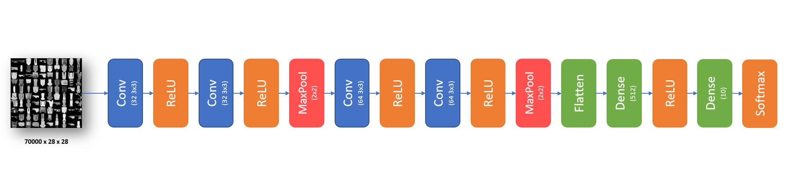

# Fashion MNIST Recognition

#### Python Dependencies:
* [Python (>= 3.6)](https://www.python.org/downloads/)
* [Tensorflow](https://www.tensorflow.org/install)
* [Keras](https://pypi.org/project/Keras/)
* [matplotlib](https://pypi.org/project/matplotlib/)
* [numpy](https://pypi.org/project/numpy/)

 

#### Dataset
---

The Fashion MNIST it's a dataset developed by Zalando SE and can be found in this [link](https://github.com/zalandoresearch/fashion-mnist). The dataset has a **700000** images of Clothes and Accessories splited in tem 10 classes:

* `T-shirt/top`
* `Trouser`
* `Pullover`
* `Dress`
* `Coat`
* `Sandal`
* `Shirt`
* `Sneaker`
* `Bag`
* `Ankle boot`

<h4 style="text-align: center">Preview</h4>

    

 
 
 
 
 
 

### Deep Neural Network
---

<h4 style="text-align: center">Normalize the dataset</h4>

* Reshape the image vector from 2D images to 3D with this distribuition (inputs size, height, columns, colors). That reshape basicly add one more dimesion corresponding the color, just is a pattern,.
* Rescale the value of each one pixel. THe variace between 0 and 255 probably will incresse too much the value of the weight, making the train more difficult. To solve that problem we rescale into 0 and 1.
* Tranform the result to categorial. The Fashion MNIST split the classes of the clothes using values between 0 and 9, but isn't scalar problem, so it's necessary tranform into a vector with mutiples results. E.g.: Case the value is 4 the result will be [0, 0, 0, 0, 1, 0, 0, 0, 0, 0]

 
 

<h4 style="text-align: center">Sequential</h4>

* After train and retrain a lot of diferentes layers that was the sequencial whitch got more accuracy with less epochs and time trainning:

 
 

<h4 style="text-align: center">Results</h4>

 
 
 

Developed by Anderson Laurentino @ 2019